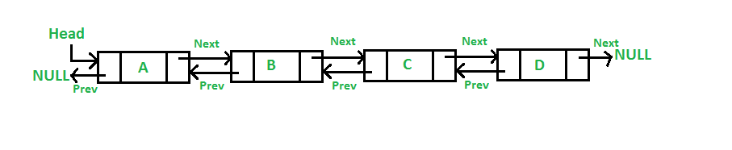

# Doubly Linked List

## Definition

A doubly linked list is a type of linked list in which each node contains 3 parts, a data part and two addresses, one points to the previous node and one for the next node. It differs from the singly linked list as it has an extra pointer called previous that points to the previous node, allowing the traversal in both forward and backward directions.

In this article, we will learn about the doubly linked list implementation in C. We will also look at the working of the doubly linked list and the basic operations that can be performed using the doubly linked list in C.

A doubly linked list is represented in C as the pointer to the head (i.e. first node) in the list. Each node in a doubly linked list contains three components:

* Data: data is the actual information stored in the node.
* Next: next is a pointer that links to the next node in the list.
* Prev: previous is a pointer that links to the previous node in the list.

### References

[geeksforgeeks - Doubly Linked List in C](https://www.geeksforgeeks.org/doubly-linked-list-in-c/)