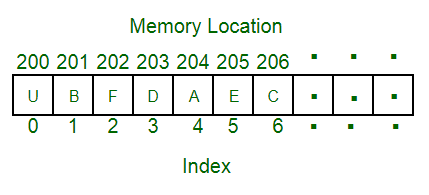

# Linear or Sequencial List / Linear Data Structure - C

## Definition

Linear Data Structures are a type of data structure in computer science where data elements are arranged sequentially or linearly. Each element has a previous and next adjacent, except for the first and last elements.

### Characteristics of Linear Data Structure:

* Sequential Organization: In linear data structures, data elements are arranged sequentially, one after the other. Each element has a unique predecessor (except for the first element) and a unique successor (except for the last element)
* Order Preservation: The order in which elements are added to the data structure is preserved. This means that the first element added will be the first one to be accessed or removed, and the last element added will be the last one to be accessed or removed.
* Fixed or Dynamic Size: Linear data structures can have either fixed or dynamic sizes. Arrays typically have a fixed size when they are created, while other structures like linked lists, stacks, and queues can dynamically grow or shrink as elements are added or removed.
* Efficient Access: Accessing elements within a linear data structure is typically efficient. For example, arrays offer constant-time access to elements using their index.

Linear data structures are commonly used for organising and manipulating data in a sequential fashion. Some of the most common linear data structures include:

### References

[geeksforgeeks - Introduction to Linear Data Structures](https://www.geeksforgeeks.org/introduction-to-linear-data-structures/)